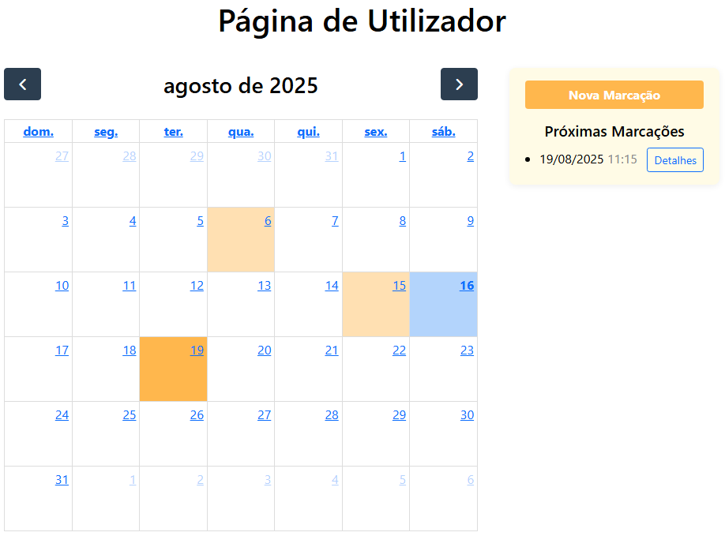

# FluvAuto - Sistema de Gestão Oficina Automóvel

[](https://dotnet.microsoft.com/)
[](https://dotnet.microsoft.com/apps/aspnet)
[](https://docs.microsoft.com/en-us/ef/)
[](https://getbootstrap.com/)

[English Version](README.en.md)
## Descrição

**FluvAuto** é um sistema web para gestão de oficinas automóveis, desenvolvido em **ASP.NET Core 8.0** com **Entity Framework Core**. O sistema permite gerir clientes, funcionários, viaturas, marcações de serviços e acompanhar o fluxo de trabalho da oficina.


## Tecnologias Utilizadas

### **Backend**
- **ASP.NET Core 8.0** - Framework web
- **Entity Framework Core** - ORM para base de dados
- **ASP.NET Identity** - Autenticação e autorização
- **SQL Server / SQLite** - Base de dados
- **Swagger/OpenAPI** - Documentação da API

### **Frontend**
- **Razor Pages** - Engine de templates
- **Bootstrap 5** - Framework CSS
- **JavaScript** - Funcionalidades dinâmicas
- **HTML5 & CSS3** - Estrutura e estilo


## Como Executar

### **Pré-requisitos**
- [.NET 8.0 SDK](https://dotnet.microsoft.com/download)
- [SQL Server](https://www.microsoft.com/sql-server) ou SQLite
- [Visual Studio 2022](https://visualstudio.microsoft.com/) ou [VS Code](https://code.visualstudio.com/)

### **Instalação**

1. **Clone o repositório:**
```bash
git clone https://github.com/Campi98/DWeb_FluvAuto.git
cd fluvAuto
```

2. **Configure o connection string:**
   - Edite `appsettings.json`
   - Configure a ligação para o SQL Server ou SQLite

3. **Execute as migrações:**
```bash
Update-Database
```

5. **Execute a aplicação:**
```bash
dotnet run    (ou clicar no run do VS2022)
```

6. **Aceda no browser:**
   - **Web:** `https://localhost:7001`
   - **API:** `https://localhost:7001/swagger`

## Autenticação

### **Utilizadores Padrão (com o DBInitializer):**

| Tipo | Email | Password | Permissões |
|------|-------|----------|------------|
| Admin | admin@admin.com | Admin12345! | Acesso total |
| Funcionário | maria@email.com | Password123! | Gestão de serviços |
| Cliente | joao@email.com | Password123! | Visualização própria |

## Prints

| Descrição | Imagem |
|-----------|--------|
| Diagrama Entidade-Relacionamento |  |
| Mockup Página Inicial |  |
| Mockup Página Utilizador |  |
| Mockup Página Admin |  |
| Mockup Login & Registo |  |
| Página Inicial (Real) |  |
| Página Sobre |  |
| Página Login |  |
| Vista Tabelas Admin |  |
| Página Utilizador |  |
| Nova Marcação |  |